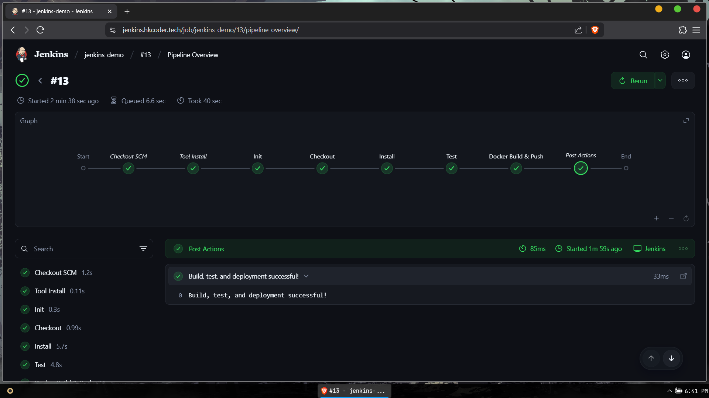
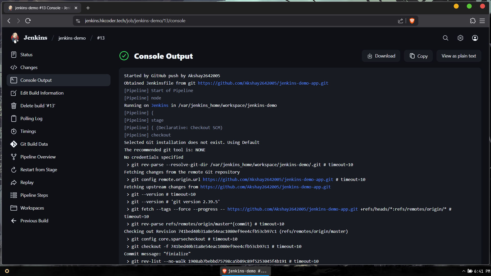

# 🚀 Vite App CI/CD with Jenkins

This project demonstrates a complete CI/CD pipeline using **Jenkins**, **Docker**, and **GitHub Webhooks** for a simple [Vite](https://vitejs.dev) app.

Whenever code is pushed to the GitHub repository, Jenkins:
- Installs dependencies
- Runs tests and vulnerability checks
- Builds the Vite app for production
- Builds and pushes a Docker image to Docker Hub

---

## 📂 Repository Structure

```
.
├── Dockerfile            # Docker build for Vite app
├── Jenkinsfile           # Jenkins pipeline definition
├── dist/                 # Production build (auto-generated)
├── src/                  # Vite source code
├── package.json
└── ...
```

---

## ⚙️ CI/CD Pipeline Stages

The Jenkins pipeline includes:

1. ✅ **Checkout** – Clone the latest code from GitHub
2. 📦 **Install** – Install dependencies using `npm ci`
3. 🧪 **Test** – Run unit tests, audit for vulnerabilities, and ensure `dist/` builds
4. 🐳 **Docker Build & Push** – Build the Docker image and push it to Docker Hub

---

## 🐙 GitHub Webhook Integration

Webhooks are configured to POST to:

```
https://jenkins.hkcoder.tech/github-webhook/
```

This triggers Jenkins on every `git push`.

---

## 🐳 Docker

The Docker image is built from the Vite production build (`dist/`) and served using `nginx`.

### Dockerfile:
```Dockerfile
FROM node:20-alpine AS builder
WORKDIR /app
COPY . .
RUN npm ci && npm run build

FROM nginx:alpine
COPY --from=builder /app/dist /usr/share/nginx/html
EXPOSE 80
CMD ["nginx", "-g", "daemon off;"]
```

---

## 🧪 Sample Test (Vitest)

```js
import { describe, it, expect } from 'vitest'

describe('Basic math', () => {
  it('adds numbers correctly', () => {
    expect(1 + 2).toBe(3)
  })
})
```

---

## 📸 Screenshots

### ✅ Jenkins Build Success


### ✅ Github Scm Push Trigger Success


---

## 📦 Build Locally

```bash
# Install dependencies
npm ci

# Run tests
npm test

# Build for production
npm run build

# Run locally
npm run preview
```

---

## 🛠️ Built With

- [Vite](https://vitejs.dev)
- [Jenkins](https://www.jenkins.io)
- [Docker](https://www.docker.com)
- [Vitest](https://vitest.dev)
- [GitHub Webhooks](https://docs.github.com/en/webhooks)

---

## 📜 License

MIT License © Akshay2642005
